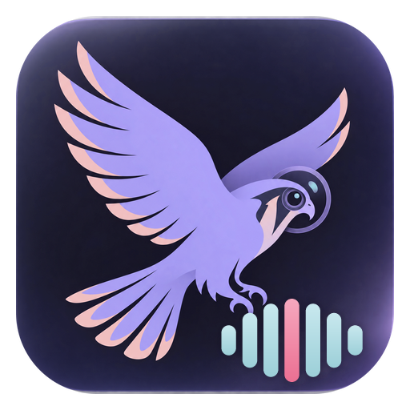

# Kestrel Audio

**Makes the sound of a Kestrel bird or animal detection actually audible, and cleaner only when that is proven safe.**

Part of the [Kestrel](https://github.com/nphil/kestrel) family: a small service that runs on your home server next to
BirdNET-Go and hands the Kestrel app a *preview* of each detected call.

## What it does, in plain words

The clips BirdNET-Go saves are recorded about **100 times too quietly**. Tap play on a "Blue Jay" and you hear almost
nothing. Kestrel Audio fixes that in three steps:

1. **It finds the moment.** Google's *Perch* bird AI listens to the 15 second clip and says where it was surest that the
   animal was calling. That moment (usually 5 to 9 seconds, plus half a second either side) is the preview.
2. **It makes it loud.** The moment is brought to a normal listening level (-16 LUFS, peaks kept under -1 dBTP) and saved as
   a small AAC file that plays everywhere, including an iPhone.
3. **It tries to clean it up, and only keeps the clean-up if it is proven safe.** Two things are tried on every clip: turning
   down the steady background hiss, and splitting the sound into tracks with a second Google AI and turning down the tracks
   that are not the animal. Each attempt is then **re-checked by Perch**. If Perch is even slightly less sure of the animal
   than it was on the untouched moment, the attempt is thrown away. If nothing passes (the usual case), you simply get the
   untouched moment, made loud.

What you notice: the preview sits right on the animal, it is loud enough to hear, and a "Cleaned" mark appears only when a
clean-up passed the check.

### Why not just clean everything?

Because on real camera audio it usually hurts. On the 27 real clips we tested, strong hiss reduction made Perch **less**
sure of the animal on 24 of 27 clips, and AI track separation lowered it on 21 to 25 of 27, because both methods also
remove the quiet parts of a call. So the service never trusts a clean-up on faith: Perch has to agree, twice (at the original
volume and at the loud preview volume), and the animal has to stand out at least 3 dB more than before.

**On the 27 real clips we evaluated** (17 species: owls, a coyote, peepers, a squirrel, many songbirds): for 20 of them nothing
could be cleaned without losing some of the animal, so the untouched moment, made loud, was the answer; 7 got a clean-up that
Perch confirmed (for example a Barred Owl whose background dropped by 26 dB while Perch stayed 98% sure). No clip ever got a
preview that Perch liked noticeably less than the untouched moment (the largest drop was 0.007 on a 0 to 1 scale).

## Where it runs

An Unraid container (`ghcr.io/nphil/kestrel-audio`), next to the GPU apps. It is polite about the shared video card:

* It uses the **GPU only while it has work**, and only if at least 2.5 GB of video memory is free; otherwise it works on
  the CPU (slower, same result). Its own share is held under 1.5 GB and is about 0.7 GB between clips and at most about 1.2 GB at its peak (measured on a Tesla P40), then 0 once it unloads.
* The models are loaded when the first clip arrives and **unloaded after two minutes without work**: the worker process
  exits, so the video memory goes back to zero.
* One clip at a time, newest first. Previews are kept 30 days (same as BirdNET-Go), 2 GB at most.

## Install on Unraid

1. Install the **Nvidia Driver** plugin (skip if you only want the CPU).
2. Docker tab, **Add Container**, pick the template `kestrel-audio` (or paste
   `https://raw.githubusercontent.com/nphil/kestrel-audio/main/unraid/kestrel-audio.xml` as the template URL), set the GPU
   (`NVIDIA_VISIBLE_DEVICES` = your card's UUID from `nvidia-smi -L`) and the app-data folder, apply.
3. Open the WebUI: the status page shows the queue, how many previews were made today, how many were cleaned, whether it is on
   the GPU or CPU, and its video-memory use. The same page shows the **API key** (to people on your home network only); the
   key is also the text file `key` in the app-data folder.
4. Give the Kestrel Home Assistant integration the address (`http://<server>:8787`) and the key.

## For developers

* HTTP API: [`docs/api.md`](docs/api.md). `POST /v1/jobs` with the clip, then `GET /v1/previews/<id>/info` and
  `GET /v1/previews/<id>` (audio/mp4, Range, ETag).
* Layout: `kestrel_audio/` (`locate.py` finds the moment, `verify.py` is the safety gate, `loudness.py` is the loudness,
  limiter and AAC trim, `pipeline.py` ties them together, `manager.py` / `worker.py` run the models in a separate process,
  `server.py` is the API). `tests/` holds the pure-logic and HTTP tests (`pip install -r requirements-dev.txt; pytest`).
* Models: Perch v2 (ONNX, FP32) and Google's bird MixIT separators (4 and 8 tracks). The MixIT checkpoints are TensorFlow 1
  graphs; `tools/convert_mixit.py` converts them to ONNX during the image build (TensorFlow is only in that build stage).
  Everything runs in FP32 (the P40's FP16 is 1/64 speed) through ONNX Runtime 1.26, the last release built for CUDA 12 (newer
  ones dropped Pascal cards).
* Release: run the **build-and-push** workflow with `version` (`X.Y.Z`) and `notes`; it runs the tests, builds the image,
  smoke-tests it on the CPU path, pushes `ghcr.io/nphil/kestrel-audio:X.Y.Z` and `:latest`, and publishes the GitHub Release
  that Unraid's ShipLog shows. Without a version it only builds and tests.

## Honest limits

* The AI cannot cancel a sound that sits on top of the animal at the same pitch; on those clips nothing passes and you get the
  untouched moment.
* Perch is the judge of its own work, so a result it likes is a result it likes: the safety check guards against damage, it is
  not a second opinion.
* A clip whose species Perch does not know (or that arrives without a scientific name) gets BirdNET-Go's own detection window,
  made loud and never cleaned. The same goes for a clip where Perch is barely sure of the animal (its best match is under 10%):
  there is no real moment to find, and a clean-up could not be checked against such a low score.

## Licence

MIT. Models and libraries keep their own licences: see [`THIRD_PARTY_NOTICES.md`](THIRD_PARTY_NOTICES.md).
